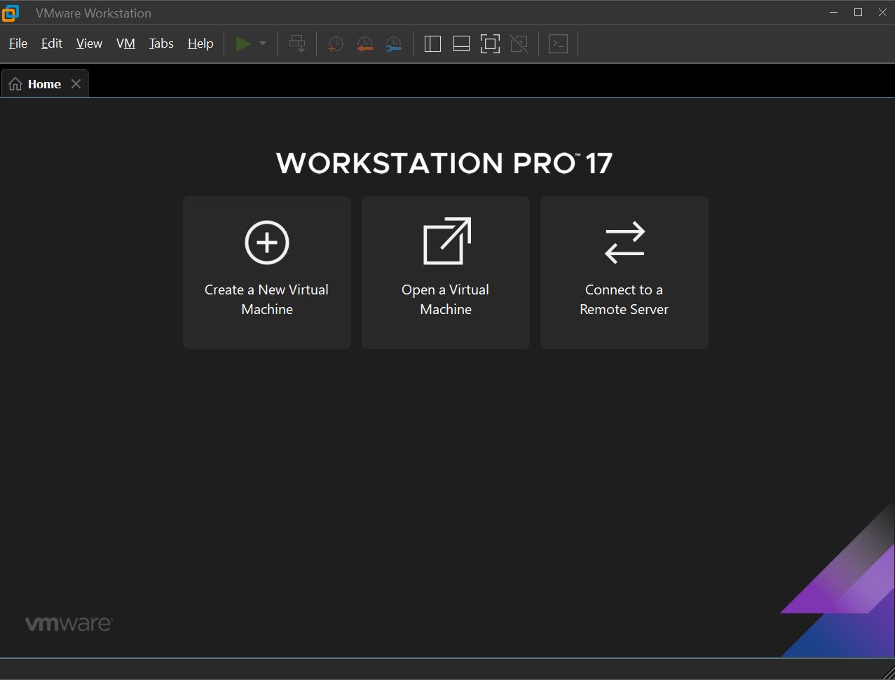

# Тестовое задание

# Создание виртуальной машины

Для создания виртуальной машины предлагается к использованию гипервизор
VMware Workstation 17 Pro и файл с расширением .iso, скаченный по этой ссылке
**https://ubuntu.com/download/desktop**. Лицензионный ключ можно получить на
сайте: https://gist.github.com/AYan40/1682f0101dd1f054d8e62a6d

В окне VMware выбираем Create a New Virtual Machine.

Далее оставляем все настройки по умолчанию, указываем наш файл с расширением
.iso, выбираем от 2 гб оперативной памяти, нам хватит и 2 процессора, а размер
диска от 10гб. Для доступа к сети интернет настраиваем сетевой адаптер на NAT.
Чтобы доступ через сеть NAT работал укажем настройки аналогично ниже
представленным


Должно получиться примерно следующее. Включаем виртуальную машину, нажав
на кнопку Power

Далее необходимо будет выбрать регион, язык, установить имя пользователя,
виртуальной машины и пароль. Подождать загрузку, перезагрузить виртуальную


машину и приступать ко второй части работы.

# Docker и приложение.

В виртуальной машине следует открыть Терминал и ввести следующие команды

```
sudo apt-get update
sudo apt-get dist-upgrade
```
Команды нужны для обновления компонентов системы.

Далее предстоит выполнить следующие команды

sudo apt install apt-transport-https ca-certificates curl software-properties-common

curl -fsSL https://download.docker.com/linux/ubuntu/gpg | sudo apt-key add -
sudo add-apt-repository "deb [arch=amd64] https://download.docker.com/linux/ubuntu
$(lsb_release -cs) stable"

echo "deb [arch=$(dpkg --print-architecture)] https://download.docker.com/linux/ubuntu
xenial stable" | sudo tee /etc/apt/sources.list.d/docker.list > /dev/null

sudo apt-get update
sudo apt-get install docker-ce docker-ce-cli containerd.io
sudo apt install python
sudo curl -L "https://github.com/docker/compose/releases/latest/download/docker-
compose-$(uname -s)-$(uname -m)" -o /usr/local/bin/docker-compose

```
sudo chmod +x /usr/local/bin/docker-compose
```

Проверим командой docker-compose --version установку данной утилиты

Теперь скачаем go.

Скачайте Go с официального сайта

```
wget https://golang.org/dl/go1.XX.linux-amd64.tar.gz
```
Распакуйте архив:

```
sudo tar -C /usr/local -xzf go1.XX.linux-amd64.tar.gz
```
Добавьте путь к Go в переменные окружения: Откройте файл конфигурации вашего
терминала, например, 

```
~/.bashrc
nano ~/.bashrc
```
Добавьте следующие строки в конец файла

```
export PATH=$PATH:/usr/local/go/bin
```
Примените изменения:

```
source ~/.bashrc
```
Перейдем в директорию project, где будем реализовывать всё

Введем команды

go mod init project

```
go mod tidy
```
Затем создаем файлы представленные в этом репозитории.

В командной строке вводим команду

```
sudo docker-compose up --build
```
Должны увидеть следующее


Затем перейдем в брайзер и в поисковой строке введем [http://localhost:](http://localhost:)

Увидим следующее:


С помощью ввода ctrl+C docker-compose завершает работу, если команду
выполнить еще раз, то последние сообщения останутся.

# Сетевые настройки


Далее необходимо настроить виртуальную машину, добавив новый сетевой
адаптер, настроенный на кастомную сеть, например, VMnet0. Затем нажать
edit→Virtual network editor→change settings→yes→add network и подключить эту сеть
к сетевому мосту


На виртуальной машине узнать ip-address командой ip -br a выбрать тот, что
относится ко второму адаптеру, это обычно ens37. У меня ip-address был равен
10.193.93.

Тогда запускаем опять на виртуальной машине docker-compose, а затем в браузере
вводим **[http://10.193.93.13:8080/](http://10.193.93.13:8080/)**

Появились все записи, введенные на виртуальной машине, и записи с хоста так же
видно на виртуальной машине.
